<div align="center">

# SelfShare

### A secure ephemeral vault for sharing encrypted text and files through one-time links.


**SelfShare** encrypts secrets directly in the browser, stores only encrypted payloads on the server, and destroys each secret after it is revealed or expired.

</div>

---

## Overview

SelfShare is a full-stack Spring Boot application designed for secure temporary sharing. Users can create an encrypted message or file, generate a private link, and send it to a recipient. The recipient can reveal the secret once; after that, the backend deletes it permanently.

The encryption key is never stored by the backend. It is placed in the URL fragment after `#`, which browsers do not send to the server.

---

## Core Features

| Feature | Description |
| --- | --- |
| Client-side encryption | AES-GCM encryption using the Web Crypto API before data leaves the browser. |
| One-time access | Secret is deleted immediately after the reveal endpoint is called. |
| Expiration cleanup | Scheduled cleanup removes unread expired secrets. |
| File support | Encrypted file sharing with a 10 MB upload limit. |
| QR code sharing | Generates a QR code for mobile access. |
| Admin dashboard | Tracks active secrets, audit logs, and emergency purge actions. |
| API documentation | Swagger UI available for development and testing. |

---

## Tech Stack

<div align="center">


</div>

---

## Security Flow

```mermaid
flowchart LR
    A["User writes a secret"] --> B["Browser generates AES-GCM key"]
    B --> C["Browser encrypts content"]
    C --> D["Backend stores encrypted payload + IV"]
    D --> E["Share link contains id + key fragment"]
    E --> F["Recipient opens link"]
    F --> G["Backend returns encrypted payload once"]
    G --> H["Backend deletes the secret"]
    H --> I["Browser decrypts locally"]
```



Important: the generated link contains the decryption key in the URL fragment. Share it only through a trusted channel.

---

## Project Structure

```text
src/main/java/com/selfshare
  config/        Spring Security configuration
  controller/    REST and admin controllers
  entity/        JPA entities
  repository/    Spring Data repositories
  service/       Secret, cleanup, file, and mail services

src/main/resources/static
  index.html     Entry screen
  vault.html     Secret creation UI
  view.html      Secret reveal UI
  admin/         Admin dashboard
  js/            API and crypto logic
  css/           Cyber-style interface
```

---

## Configuration

SelfShare uses environment variables for sensitive values. Do not commit real credentials.

| Variable | Purpose | Default |
| --- | --- | --- |
| `SELFSHARE_DB_URL` | MySQL JDBC URL | `jdbc:mysql://localhost:3306/selfshare_db?...` |
| `SELFSHARE_DB_USERNAME` | Database username | `root` |
| `SELFSHARE_DB_PASSWORD` | Database password | empty |
| `SELFSHARE_MAIL_HOST` | SMTP host | `localhost` |
| `SELFSHARE_MAIL_PORT` | SMTP port | `1025` |
| `SELFSHARE_MAIL_USERNAME` | SMTP username | empty |
| `SELFSHARE_MAIL_PASSWORD` | SMTP password | empty |
| `SELFSHARE_ADMIN_USERNAME` | Admin username | `admin` |
| `SELFSHARE_ADMIN_PASSWORD` | Admin password | `change-me` |

Examples are available in [.env.example](.env.example) and [application-example.properties](application-example.properties).

---

## Run Locally

Create the database:

```sql
CREATE DATABASE IF NOT EXISTS selfshare_db;
```

Start the application:

```bash
mvn spring-boot:run
```

Open the app:

| Page | URL |
| --- | --- |
| Vault | `http://localhost:8081` |
| Admin | `http://localhost:8081/admin/admin.html` |
| Swagger UI | `http://localhost:8081/swagger-ui.html` |

---

## Test

```bash
mvn test
```

The test suite uses an in-memory H2 database, so MySQL is not required for automated tests.

---

## API Overview

| Method | Endpoint | Description |
| --- | --- | --- |
| `POST` | `/api/secrets` | Store an encrypted secret |
| `POST` | `/api/secrets/{id}/reveal` | Reveal and delete a secret |
| `GET` | `/api/secrets/qr?link=...` | Generate a QR code |
| `GET` | `/api/admin/stats/count` | Count active secrets |
| `GET` | `/api/admin/logs` | Read audit logs |
| `DELETE` | `/api/admin/purge-all` | Delete all stored secrets |

---

## Production Notes

- Change the default admin password before any public demo.
- Rotate any credentials that were ever committed in Git history.
- Use HTTPS in production.
- Review CORS and CSRF settings before deployment.
- Keep SMTP, database, and admin credentials in environment variables.
